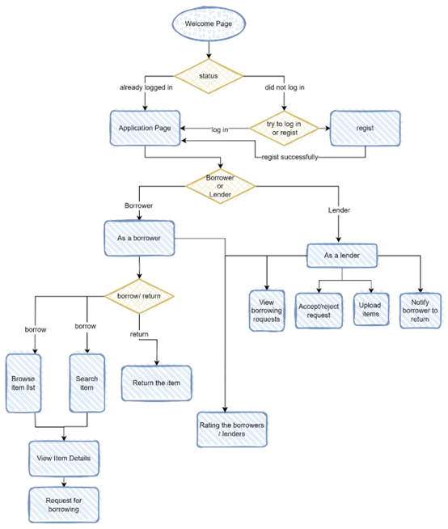
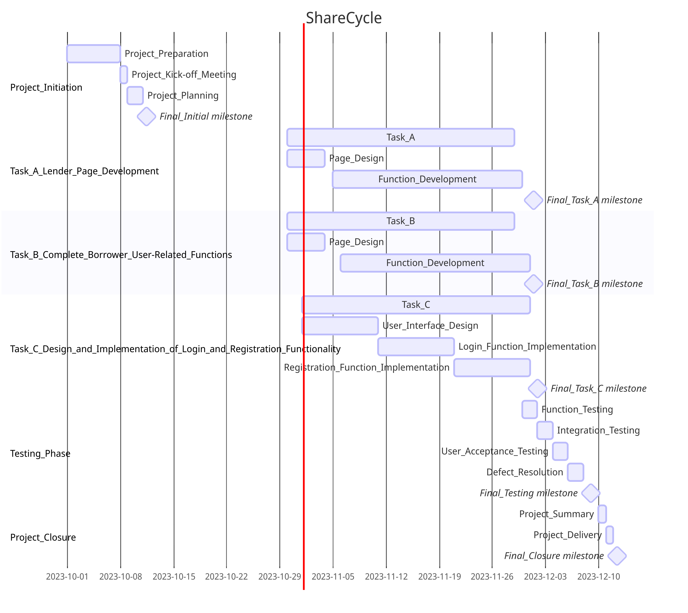

# Software Requirements Specification

## Team X-MEN
·Pinguo Huang

·Wuying Kang

·Jiaxin Shen

## Name: ShareCycle
App name options:

•	ShareU

•	BorrowBuddy

•	ShareCycle

•	CampusCommune

## Purpose
The purpose of designing this software, aimed at NEU students for the gratuitous lending and borrowing of items, is to establish an intra-campus mutual assistance and sharing platform. We hope that through this software, students can conveniently borrow or lend out items they temporarily don't need, but which might be urgently required by their peers, such as textbooks, study tools, and daily necessities. This initiative not only conserves resources and reduces waste but also strengthens the spirit of mutual assistance among students, fostering a more harmonious and convenient living environment for the entire school community.

## Definitions
Our team has meticulously crafted ‘ShareCycle’ for NEU students - an innovative digital sharing platform. Our goal is to promote a culture of mutual assistance and resource sharing within the campus. With this application, students can conveniently lend or borrow items they aren't currently using, ranging from textbooks to everyday essentials. Through ‘ShareCycle’, we aspire not only to enhance the efficiency of resource utilization but also to further strengthen the ties and collaboration within the NEU student community, collectively forging a more harmonious and efficient campus living environment.

## Background
In contemporary society, the sharing economy is a concept that resonates with many. The rise of the sharing economy, exemplified by the global success of platforms like Airbnb and Uber, highlights the manifold benefits of resource sharing. Moreover, in our preliminary user survey, we interviewed several NEU students. Their feedback illustrated a scenario where the university boasts abundant resources, yet they are not evenly distributed. For instance, many students purchase textbooks or study materials for short-term use, and some struggle to access specific resources during pivotal moments, such as right before examinations or project deadlines.
Inspired by these insights and survey findings, our team discerned the necessity for a platform tailored specifically for the Northeastern University student community. On this platform, students can share or borrow resources, promoting a sense of community and collaboration while optimizing resource utilization and minimizing waste. Consequently, the concept of 'ShareCycle' was conceived: a platform designed to maximize resource efficiency, enhance student connectivity, and foster a more harmonious and sustainable campus environment.

## Overall Description
### User Characteristics
Age: Above 18 (who can be responsible for their duty if they broken or lost the item from others).

Gender: Male and female.

This application is exclusively targeted at the enrolled students of
Northeastern University. User registration must be validated using a university email address to ensure the authenticity of users participating in all borrowing and returning activities. The transaction locations are typically set to on-campus university locations to ensure security.

### User Stories
#### •	As a Borrower, I want to be able to browse the list of available items.

#### •	As a Borrower, I want to view a list of items that are available for borrowing.

  I should be able to scroll through the list and see the items' names and basic information.

#### •	As a Borrower, I want to be able to search for specific types of items.

  I should have the ability to enter search keywords or filter options to find the items I need.

  The search results should be relevant to the keywords I provide.

#### •	As a Borrower, I want to be able to view detailed information about items and their availability.

  When I click on an item in the list, I should see a page with detailed information.

  This information should include photos, descriptions, and the item's availability status.

#### •	As a Borrower, I want to be able to submit a request to borrow an item.

  After selecting an item, I should have the option to submit a request to borrow it.

  I may need to provide details such as the duration I want to borrow it for.

#### •	As a Lender, I want to be able to view and manage borrowing requests.

  I should receive notifications of borrowing requests from Borrowers.

  I want to see a list of pending requests and the details of each request.

  I	should	be	able	to	approve	or	reject	requests	based	on	my availability.

#### •	As a Lender, I want to be able to set the availability time and location for my items.

  I should have the option to specify when and where my items are available for borrowing.

  This helps Borrowers know when they can request to borrow my items.

#### •	As a User, I want to be able to view my borrowing history.

  I should have access to a list of items I've borrowed in the past.

  This list should include details like the borrowed item, duration, and return status.

#### •	As a User, I want to be able to view my lending history.

  I should have access to a list of items I've lent to others.

  This list should include details like the borrowed item, borrower's information, and lending history.

#### •	As a User, I want to be able to easily modify my personal information to keep my information up-to-date and accurate.

#### •	As a user, I want to be able to review notifications from the system in a timely manner.

  I should be aware of how the system or other users are affecting me or providing information. 
  
  For example: borrower requests for loans, results of my loan requests, return notifications, evaluation notifications, etc.

### App workflow(flowchart)

## Requirements
### Functional Requirements

#### 1. User Registration and Authentication

User Registration: Users must be able to create an account using their real names, Northeastern University student authentication email, and passwords. Additionally, they can upload a profile picture and provide optional personal information for a more personalized experience.

Authentication: Users are required to upload a photo of their Northeastern University student ID during registration.

#### 2. Lender Post Items

Posting Items: Lenders can post information about items they are willing to lend, including item name, description, availability schedule (start and end dates), location(e.g., 225 Terry Ave N, Seattle, WA 98109, Northeastern University), and optional photos. They can categorize items for easy browsing.

Browsing Items: Borrowers can browse a list of items available for borrowing, filter items by category, proximity, and availability, and search for specific items or keywords.

#### 3. Borrowing and Lending Items

Item Request: Borrowers can request to borrow items posted by others, and they can include a message to explain their need or intended use.

Item Acceptance: Lenders can accept or reject item requests promptly.

Item Return: Borrowers can mark items as returned through the app.

#### 4. Borrower Rating Limit for Valuable Items

Rating Threshold: Borrowers must maintain a rating of 4.7 or higher to be eligible for borrowing valuable items. This ensures that only trusted users with a history of responsible borrowing can access high-value items.

#### 5. Rating and Review System

Rating Submission: Both borrowers and lenders can rate each other and provide detailed reviews after completing a rental process. Ratings can cover aspects like punctuality, item condition, and overall experience. 

View Ratings: Users can view the ratings and reviews of other users to assess their trustworthiness and past interactions.

#### 6. Location Choosing Based Borrowing Selection

Choose Location: Users should be able to select borrowing locations around two NEU building (221 and 401), enabling them to choose the most convenient pickup and return points for items.

#### 7. User History View

Borrowing History: Users must have access to a comprehensive list of items they have borrowed in the past. 

Lending History：Users need to be able to access a list of items they have previously lent out.

#### 8. Personal Information Management

Modify Personal Information: Users should have the capability to update and modify their personal information easily. This includes the ability to change password and any other relevant personal data stored within the system.

#### 9. Notifications

Item Requests Notifications: Lenders should receive notifications when someone requests to borrow their items. 

Return Reminders: Borrowers should receive reminders to return borrowed items on time.

### Non-functional Requirements

#### 1. Security and Privacy

User Data Protection: User data, including real names and email addresses, must be securely stored and transmitted.

Data Privacy: Ensure compliance with privacy regulations, and obtain user consent for data usage.

#### 2. Performance

Responsiveness: The app should respond promptly to user actions and handle a reasonable load.

#### 3. Usability

User-Friendly Interface: The user interface should be intuitive and accessible to users.

#### 4. Compatibility

Platform Compatibility: The app should be compatible with popular mobile platforms.

#### 5.  Reliability

Availability: The app should be available for use with minimal downtime.

#### 6. Legal Compliance

Terms of Service: Ensure that users agree to terms of service that outline Northeastern University community guidelines and proper conduct.

## Wireframes
[HI-FI WIREFRAMES.pdf](./HI-FI%20WIREFRAMES.pdf)

## UML Class Diagram

## Gantt Diagram

## Traceability Matrix

